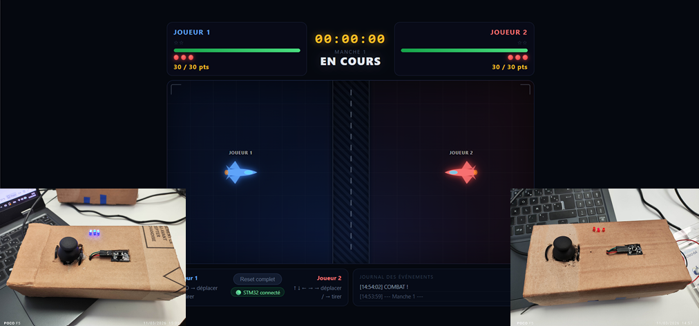

# Jeu de Duel STM32 - Interface Web

Interface web pour un jeu de duel 1v1 utilisant des manettes STM32.



## Description

Ce projet est l'interface web d'un jeu de duel où deux joueurs s'affrontent en utilisant des manettes physiques basées sur des microcontrôleurs STM32L053. Chaque joueur contrôle un vaisseau et peut se déplacer et tirer sur son adversaire.

### Fonctionnalités

- **Affichage en temps réel** : Interface Vue.js avec animations fluides
- **Système de score** : 30 points par joueur, -1 point par touche
- **LEDs synchronisées** : Les LEDs des manettes reflètent les points de vie
- **Chronomètre** : Temps de jeu affiché en HH:MM:SS
- **Manches** : Système de rounds avec écran de victoire
- **Contrôles hybrides** : Jouable au clavier ou avec les manettes STM32

## Installation

### Prérequis

- [Node.js](https://nodejs.org/) v18 ou supérieur
- npm (inclus avec Node.js)

### Installation des dépendances

```bash
# Interface web (Vue.js)
npm install

# Serveur WebSocket
cd server
npm install
cd ..
```

## Utilisation

### 1. Lancer le serveur WebSocket

Le serveur fait le pont entre les manettes STM32 (via port série) et l'interface web.

```bash
cd server
node server.js
```

Configurez les ports COM dans `server/server.js` si nécessaire :
```javascript
const SERIAL_PORTS = [
  { path: "COM7", id: 1 },  // Joueur 1
  { path: "COM8", id: 2 },  // Joueur 2
];
```

### 2. Lancer l'interface web

```bash
npm run dev
```

Ouvrez http://localhost:5173 dans votre navigateur.

### 3. Contrôles

| Action | Joueur 1 (Clavier) | Joueur 2 (Clavier) | Manette STM32 |
|--------|-------------------|-------------------|---------------|
| Haut | Z | ↑ | Joystick haut |
| Bas | S | ↓ | Joystick bas |
| Gauche | Q | ← | Joystick gauche |
| Droite | D | → | Joystick droite |
| Tirer | Espace | Entrée | Bouton poussoir |

## Structure du projet

```
jeu/
├── src/
│   ├── components/          # Composants Vue.js
│   │   ├── DuelGame.vue     # Composant principal
│   │   ├── GameArena.vue    # Zone de jeu
│   │   ├── PlayerShip.vue   # Vaisseau joueur
│   │   ├── PlayerStatus.vue # Barre de vie et score
│   │   └── Projectile.vue   # Projectiles
│   ├── composables/
│   │   └── useGame.js       # Logique du jeu
│   ├── assets/
│   │   └── jeu.css          # Styles globaux
│   ├── App.vue
│   └── main.js
├── server/
│   └── server.js            # Serveur WebSocket + SerialPort
├── package.json
└── vite.config.js
```

## Protocole série STM32

### Messages reçus (STM32 → Serveur)

| Message | Description |
|---------|-------------|
| `1` | Bouton appuyé (tir) |
| `UP` | Joystick vers le haut |
| `DOWN` | Joystick vers le bas |
| `LEFT` | Joystick vers la gauche |
| `RIGHT` | Joystick vers la droite |
| `T` | Tick chronomètre (1 seconde) |

### Messages envoyés (Serveur → STM32)

| Message | Description |
|---------|-------------|
| `L` | Éteindre une LED (perte de vie) |
| `B` | Reset (nouvelle manche) |

## Technologies

- **Frontend** : Vue.js 3, Vite
- **Backend** : Node.js, WebSocket (ws), SerialPort
- **Hardware** : STM32L053R8 Nucleo

## Auteurs

- SESSOU Winsou Richard
- MAZIRE Tristan

**ESIEA - SYS3046 - 2026**
